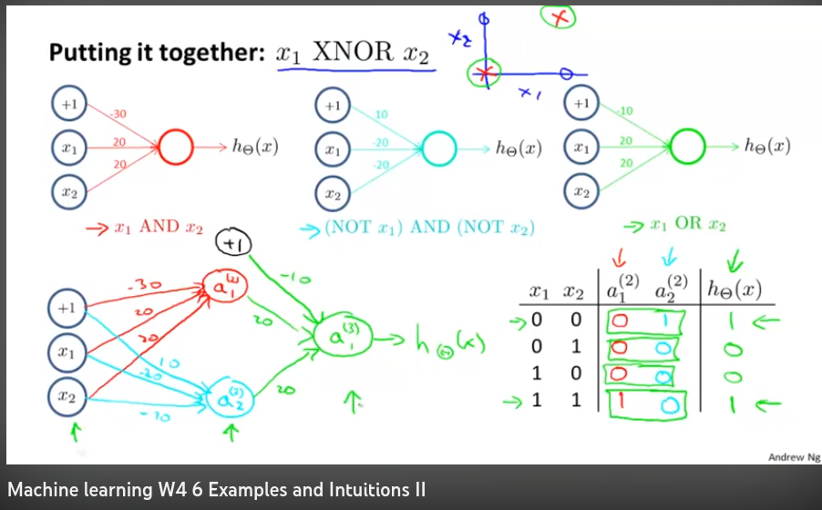

import YouTubeVid from "../../components/YouTubeVid";
import { Callout } from "nextra/components";

# Neural Networks

Though it might've been tempting to dive into neural nets and deep learning right when you started learning ML, the delayed gratification will be worth it at this point. Since you have a rock solid understanding of the basics (and of the problem spaces which don't need deep learning) you're in a great position to pick the subject up faster and to learn it in a more contextualized way.

<Callout type="warning" emoji="⚠️">
  I recommend some older versions of Andrew Ng's deep learning specialization
  that appear to have been taken down. I'd instead recommend the [newer
  version](https://www.deeplearning.ai/courses/deep-learning-specialization/) on
  the deeplearning.ai website.
</Callout>

## Andrew Ng's Intro to ML

Watch all of week four first. We'll reinforce that before moving on to week five.

<YouTubeVid id="mcnvIWDnPns" />

There's one section in particular I found indispensable, which is when Ng explains how a two layer neural net could correctly fit a XNOR (exclusive nor), a non-linear decision boundary.

He works you up to it in W4 5. In 6, "Examples and Intuitions II," it's laid out in all its glory.

Here's where the magic happens, above. Really a beautifully simple set up.

## 3 Blue 1 Brown

Before moving on to how gradient descent works with neural nets, let's get a second opinion on how these things work. The first two videos of 3 Blue 1 Brown's [Deep learning](https://www.youtube.com/watch?v=aircAruvnKk&list=PLZHQObOWTQDNU6R1_67000Dx_ZCJB-3pi) series will serve to review and reinforce. These are crucial components to effective pedagogical digestion.

<YouTubeVid id="aircAruvnKk" />

<YouTubeVid id="IHZwWFHWa-w" />

Before moving on to videos three and four in the series, let's go back to Ng and
get some of his input on backpropagation first.

## Backpropagation

Watch all of Ng's week five here. Pretty soon, you'll probably see what I referenced earlier, about the overwhelming notation. This is where I think it's so useful to have learned gradient descent well on linear regression and not just starting it now. The underlying concept is identical--backpropagation is simple gradient descent performed on the many neurons in a network.

<YouTubeVid id="18X68kLAfKY" />

Then drill the new concepts in with 3 Blue 1 Brown.

<YouTubeVid id="Ilg3gGewQ5U" />

The final video is a bit much for most non-math majors, I reckon. But it's the first example of several resources I found helpful, which are specifically included because they're way above my understanding level, yet somehow watching them start to finish feels as if it increased my intuition for other areas in the field after the fact. Let someone else explain the underlying psychology here, but I think getting totally washed over by subject matter that's way above you from time to time is a great way to enhance learning.

<YouTubeVid id="tIeHLnjs5U8" />
