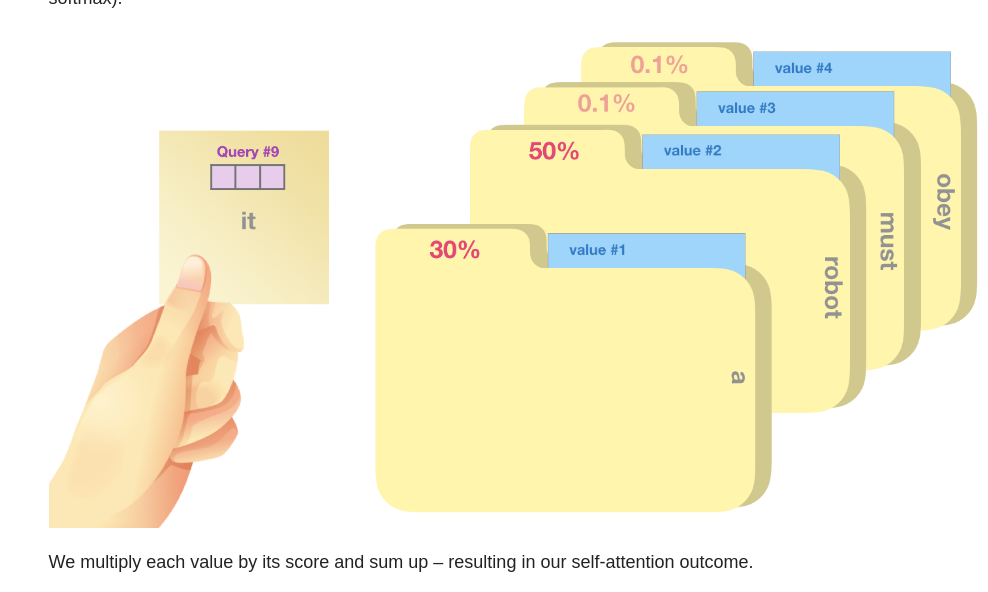

import YouTubeVid from "../../components/YouTubeVid";

# Decoders

Remember I mentioned we would revisit the Jay Alammar blogs after _The Illustrated Transformer_? Well, here we are, on our way to review the nitty-gritty of GPT-2's implementation of the decoder-only architecture. By the end of this section you'll be all caught up with as far as I made it in free YouTube ML self-study: coding GPT from scratch with Andrej Karpathy.

## The Illustrated GPT-2

This blog post is one of the best examples of educational media on technical subjects I've honestly ever come across.

There are two things about [this post](http://jalammar.github.io/illustrated-gpt2/#part-2-illustrated-self-attention) that make it an absolutely top tier example of good instructional design. One are those stunningly intuitive and clever diagrams of the query, key, and value process behaving like a post-it note being used to search through a variety of manila folders. The other is how painstaking he is about showing you every single parameter in every matrix of the entire system as a whole.

This blessed diagram is the moment the query, key, and value system of self-attention finally clicked once and for all for me.

This is what I mean about Alammar's hard work in displaying every single matrix multiplication in the architecture:

Every single one of those matrices in the C column (starting with `attn/c_attn` and going to `ln_2`) have their dimensions and parameters calculated and summed. It's all there to see. What a legend.

## Let's Build GPT with Andrej Karpathy

And now you're ready for what should hopefully feel like a victory lap. Karpathy starts _very_ small in developing ultra-simplified micro-examples of the decoder-only architecture before gradually scaling the learner up to the real thing. As an added bonus, his code is remarkably instructive and terse--real wizard level skills there.

<YouTubeVid id="kCc8FmEb1nY" />

This is as far as I've gotten in my ML self-study journey at YouTube University. In the next section, I'll list some stuff I hope to study next.
