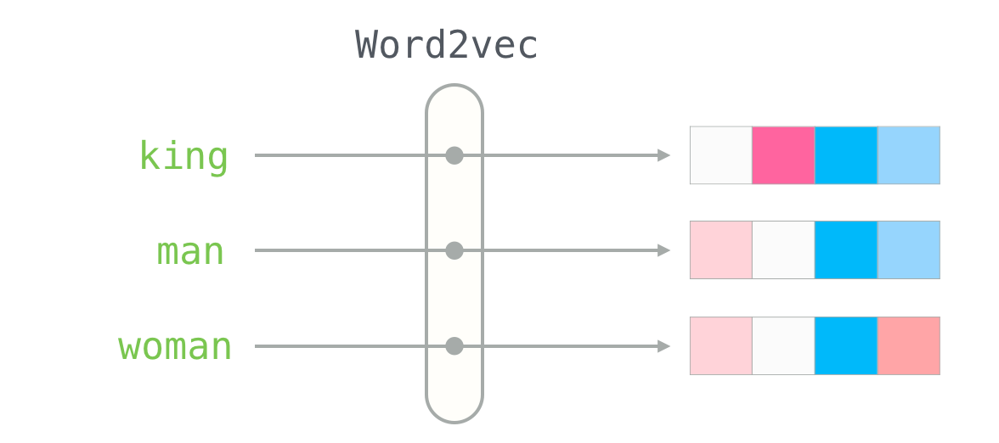
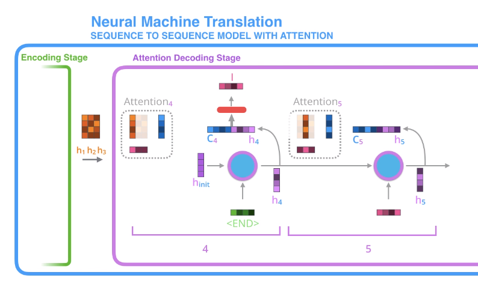

import YouTubeVid from "../../components/YouTubeVid";
import { Callout } from "nextra/components";

# Transformer Prerequisites

At this point, I began studying the fast.ai _[Practical Deep Learning for Coders](https://www.youtube.com/watch?v=8SF_h3xF3cE&list=PLfYUBJiXbdtSvpQjSnJJ_PmDQB_VyT5iU)_ course. If you watch the whole thing, you'll get a helpful review of previous subjects.

For our purposes, I'll just cite two lessons I think are essential.

## NLP - fast.ai

<YouTubeVid id="toUgBQv1BT8" />

The fast.ai course as a whole is helpful, and a great choice for you if you like to learn at a very fast pace with a wide array of workable examples. I found the course as a whole a little less exhaustive and thorough than I prefer--it kind of obeys the hacker ethos of tossing you in the deep end and showing you practical techniques, and then moving on. I prefer a slower pace. But this NLP lecture is the best resource I've found on tokenization and vocabularies. The hands-on notebooks walking through the HuggingFace tokenization libraries are invaluable.

## Collaborative Filtering - fast.ai

<YouTubeVid id="htiNBPxcXgo" />

This lesson will introduce you to embeddings and to cosine similarity search, both essential. If embeddings are confusing here, hang on and look through Jay Alammar's post below.

<Callout>
  Shoutout to Youtuber and research scientist [Aleksa
  Gordic](https://www.youtube.com/watch?v=n9sLZPLOxG8&list=PLBoQnSflObckGnAS9mXjqCZhg7VTz4x8n),
  who recommended the next three blog posts by Jay Alammar as the best way to
  learn transformers. He was right!
</Callout>

## The Illustrated Word2Vec - Jay Alammar

_From the [fantastic blog post](https://jalammar.github.io/illustrated-word2vec/) by Jay Alammar_

This is the only source I really felt I needed on the basic concept of embeddings, which are a necessary piece of the transformers puzzle. Clear as crystal and useful in many domains.

## Mechanics of Seq2Seq Models with Attention - Jay Alammar

This [blog post](https://jalammar.github.io/visualizing-neural-machine-translation-mechanics-of-seq2seq-models-with-attention/) acts as a midway point between introductory RNN content and introductory transformers content.

RNNs which receive and output sequences are called seq2seq models. Alammar walks through how these types of RNNs make changes to how they use hidden state to relate tokens to one another in inference.

We're not fully at the transformers' method of attention yet, but learning this content well will make you confident you're on sturdy ground before diving into the heavier stuff. No need to memorize the exact attention system in the decoder of this system--just get used to thinking in this style.
